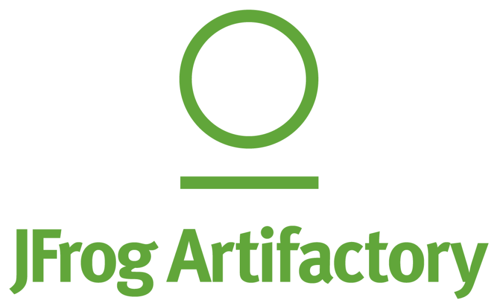

<h1 align="center">ahoy </h1>

---

<h2 align="center">About me </h3>
 
<h3 align="center">I’m working as a Cloud Engineer, enabling Engineering teams to develop, build and deploy products by providing state-of-the-art tools of the CICD stack.

To chat and learn more, you can reach out via <a href="https://www.linkedin.com/in/ioannisas">Linkedin</a>.
</h3>

---

##
<h2 align="center">🛠 Languages and Tools </h3>
 

---